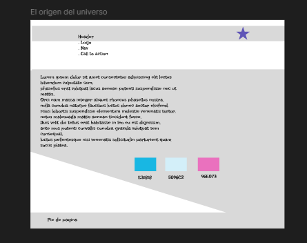

# bit-1
El origen del universo

 

Hace más de 13.800 millones de años, toda la materia y energía que conocemos estaba concentrada en un punto diminuto y extremadamente caliente. En un instante, una gran expansión —lo que hoy llamamos Big Bang— dio inicio al tiempo, al espacio y a todo lo que existe.

 
Desde ese momento, el universo no ha dejado de expandirse, enfriarse y evolucionar, formando galaxias, estrellas, planetas... y eventualmente, vida. Comprender su origen es explorar nuestras raíces cósmicas y hacernos parte de una historia que aún se está escribiendo.

 
¿Quieres aprender más sobre el origen del universo?
Déjanos tus datos para enviarte contenido exclusivo sobre los comienzos del cosmos.

wireframe básico

maquetado

Estructura de directorios y archivos (minúsculas, sin acentos, sin espacios)
HTML (más de un documento, contenido original)
CSS (Implementación archivo externo)
Bootstrap (Implementación)
JavaScript (Implementación archivo externo, modo estricto)
Funcionamiento de un formulario (Evidencia de datos ingresados)
Responsive
575px/576px
768px
992px>=

© 2025 - Proyecto de Astrofísica by Viracacháj : https://github.com/Jviracacha